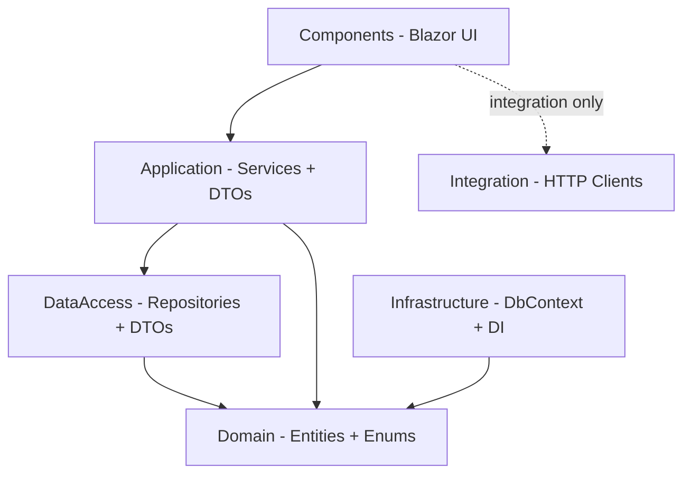
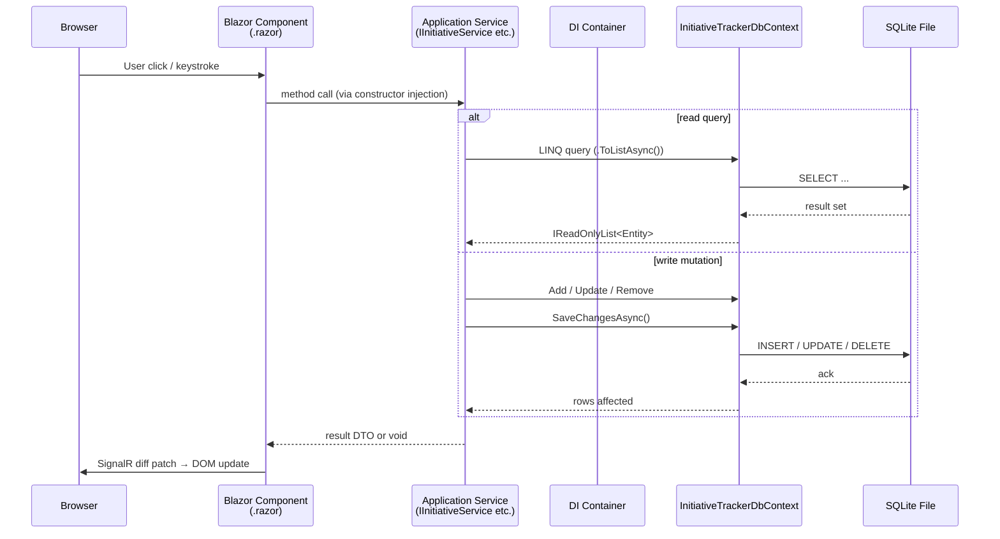
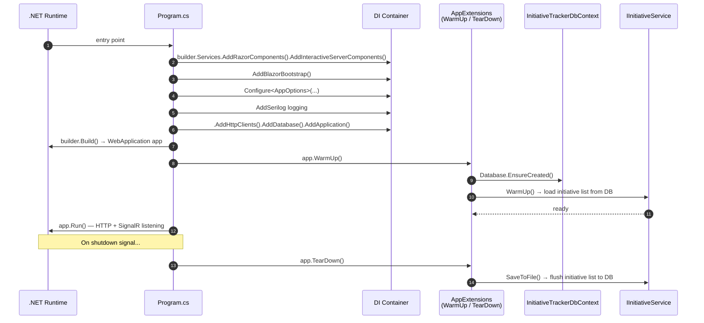
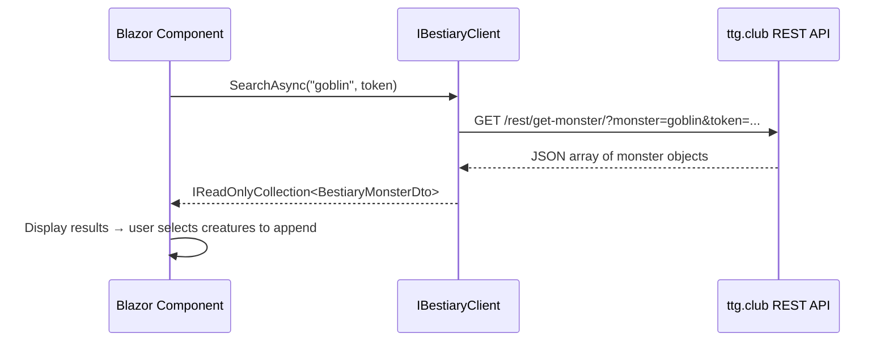

# InitiativeTracker — System Design Document

## Overview

InitiativeTracker is a single-user D&D 5e tools application built for the Dungeon Master (подготовительный режим игры). It runs as a local Web server on .NET 10 / Blazor Server with SignalR-based interactive rendering and SQLite persistence. The project uses a layered, single-project monolith architecture contained within `InitiativeTracker/`.

---

## Architectural Pattern: Layered Monolith

All production code lives in a single ASP.NET Core Web project (`InitiativeTracker/InitiativeTracker.csproj`). Layers are separated by namespaces rather than separate assemblies. This keeps development velocity high while enforcing clear dependency boundaries.

```
InitiativeTracker/
├── Domain/               — Entities, enums (innocent data)
├── Application/          — Business services, DTOs, print generators
├── DataAccess/           — Repositories and DTOs for mutation operations
├── Infrastructure/       — EF Core DbContext, DI extensions, options, storage
├── Integration/          — External HTTP clients (ttg.club)
└── Components/           — Blazor UI pages, layouts, shared components
```

### Dependency Rules (One-Way Flow)

Dependencies only flow downward. Upper layers depend on lower layers through abstractions or plain data types. Lower layers never import from upper layers.



**Strictly forbidden:**
- `Infrastructure/`, `Domain/`, or `Integration/` referencing types from `Application/` or `Components/`.
- `Domain/` having any dependency on a framework namespace (` Microsoft.EntityFrameworkCore`, etc.). Domain entities may contain EF-specific attributes only when unavoidable (preferred: separate IConfigureEntity in Infrastructure).


---

## Layer Descriptions

## 1. Domain Layer (`Domain/`)

**Responsibility:** Define the business vocabulary — entity classes and enumerations. Contains no behavior, no framework dependencies, no logic.

| Subfolder | Contents |
|-----------|----------|
| `Entities/` | `Encounter`, `Miniature`, `MagicItem`, `Spell`, `EncounterParticipant`, `ParticipantCatalogItem` |
| `Enums/` | `CreatureSize`, `ItemRarity`, `SpellClass`, `Source`, `HitsMode`, `HealthState`, `OperationMode` |

**Rules:**
- Domain entities are POCOs. No business logic, no `[Key]` or Fluent API — that belongs in the Infrastructure layer (`OnModelCreating`).
- `InitiativeListItem` is an in-memory model used by `IInitiativeService`. It bridges the gap between persisted EF entities and in-memory state manipulation (move up/down, sort, next round).

### 2. Application Layer (`Application/`)

**Responsibility:** Encapsulate all business logic. Orchestrate data flow between DbContext, external APIs, and the Blazor UI. This is the thickest layer.

| File / Folder | Role |
|---------------|------|
| `InitiativeService.cs` / `IInitiativeService` | Core initiative tracking: round management, sorting, move/append/remove operations. Loads from / saves to SQLite via DbContext. Holds an in-memory list of `InitiativeListItem`. |
| `MiniatureService.cs` / `IMiniatureService` | CRUD for miniature entities + image data retrieval from DB BLOB column. Exposes async search and get-by-id methods. |
| `ItemService.cs` / `IItemService` | CRUD for item cards (name, rarity, attunement flag, HTML description). |
| `SpellService.cs` / `ISpellService` | CRUD for spell cards (verbal/somatic/material flags, class, HTML description). |
| `Dtos/` | `MiniatureCreateDto`, `MiniatureUpdateDto`, `ItemCreateDto`, `ItemUpdateDto`, `SpellCreateDto`, etc. — used as input contracts on all service methods. Domain entities should never flow through the UI boundary directly when mutation is possible. |
| `PrintHtmlGenerators/` | Stateless generators that produce complete HTML + CSS for browser-based print output. Currently: `MiniaturePrintGenerator`, `SpellPrintGenerator`, `PokerCardPrintGenerator`. They accept entity collections and return a single HTML string. |

**Rules:**
- Every public service exposes both interface and class in the same file (co-located). Interface is private/ internal, not part of a public API surface — it exists to enable NSubstitute mocking in tests and DI binding.
- Services take `DbContext` as primary constructor dependency directly. They do NOT receive an abstraction over DbContext.
- All I/O methods on services are `async Task`. Synchronous business rules (`Next()`, `SortByInitiative()`) that operate on in-memory state may remain synchronous.


### 3. Infrastructure Layer (`Infrastructure/`)

**Responsibility:** Concrete implementation of cross-cutting concerns: data access, dependency injection registration, configuration binding, and file/HTTP utilities.

| Subfolder | Contents |
|-----------|----------|
| `Database/` | `InitiativeTrackerDbContext.cs` — single DbContext with DbSet properties for all four entity types. Fluent API mapping in `OnModelCreating`. |
| `Extensions/DiExtensions.cs` | C# 14 extension everything syntax on `IServiceCollection`: `AddDatabase()`, `AddHttpClients()`, `AddApplication()`. Registers all services as Singletons. |
| `Extensions/AppExtensions.cs` | Extension methods on `WebApplication`: `WarmUp()` (ensure DB created + load initiative list) and `TearDown()` (flush initiative list to DB). Called from `Program.cs`. |
| `Options/` | Typed options class: `AppOptions` bound to JSON config. Includes settings for browser auto-open, ttg.club base URL, API key, etc. |

**DbContext registration:** Registered as `Singleton` via `AddDbContext(..., ServiceLifetime.Singleton)`. This is intentional — the app targets a single-user local DM tool, so all services share one DbContext instance. If multi-seat is ever added, this must become `Scoped`.

### 4. Integration Layer (`Integration/`)

**Responsibility:** Communicate with external HTTP APIs. Currently wraps the ttg.club bestiary API for D&D creature lookup by keyword.

| Path | Contents |
|------|----------|
| `RestClients/TtgClub/` | `IBestiaryClient` interface + `BestiaryClient` implementation using `HttpClient`. Options class: `TtgClubClientOptions`. Returns a list of monster cards that can be appended to the initiative list. |

The integration layer is decoupled: Blazor components never call `HttpClient` directly — they go through `IBestiaryClient`, which is registered in DI via extension method in `DiExtensions.cs`. This allows switching or mocking the client.

### 5. Components Layer (`Components/`)

**Responsibility:** Present data, handle user input, coordinate service calls for UI updates. Uses Blazor Server with interactive render mode over SignalR.

#### Entry Points

| File | Role |
|------|------|
| `App.razor` | Root component — wraps `<Routes />` inside MainLayout |
| `Routes.razor` | Router configuration |
| `_Imports.razor` | Shared `@using` directives for all Razor components |

#### Layout

| File | Role |
|------|------|
| `Layout/MainLayout.razor` | Navigation sidebar + main content area. Menu items: Initiative, Miniatures, Items, Spells |
| `Layout/ReconnectModal.razor` | SignalR reconnection UX overlay |

#### Pages

Each feature has its own folder under `Components/Pages/`:

| Page Folder | Components | Purpose |
|-------------|-----------|---------|
| (root) | `Home.razor`, `Error.razor`, `NotFound.razor` | Landing and error pages |
| `Miniatures/` | `Miniatures.razor`, `AddMiniatureForm.razor`, `MiniatureCatalog.razor`, `PreparationList.razor` | Miniature CRUD + print preparation with quantity selection |
| `Items/` | `Items.razor`, `AddItemForm.razor`, `ItemCatalog.razor`, `ItemPreparationList.razor` | Item card CRUD + print preparation |
| `Spells/` | `Spells.razor`, `AddSpellForm.razor`, `SpellCatalog.razor`, `SpellPreparationList.razor` | Spell card CRUD + print preparation |

Components use Blazor.Bootstrap components for form controls, grids, modals, and navigation tabs. Interactive components are rendered with `@rendermode InteractiveServer`.

---

## Application Request Flow

### Service Call Chain (User Action → DB)

When a user interacts with the initiative board or creates a new card:



### Startup Lifecycle



Request lifecycle: `Program.cs` calls extension methods from `Infrastructure/Extensions/` which resolve services from DI and execute startup/shutdown logic. The `WarmUp()` call loads the initiative list in-memory; all subsequent edits are held in memory within `InitiativeService` and flushed out on graceful shutdown via `TearDown()`.

---

## Data Models Overview

### Database Schema (SQLite)

```mermaid
erDiagram
    InitiativeEntity {
        int Id PK
        string Name ""
        int Initiative
        int Dexterity "default 10"
        int HitsDefault
        int HitsCurrent
        int ArmorClass
        int ArmorClassCurrent
        string Link nullable
        string SourceId ""
        int OrderIndex
    }

    MiniatureEntity {
        int Id PK
        string Name ""
        CreatureSize Size
        byte ImageData BLOB
        int PrintedCount "default 0"
        string Link nullable
        decimal CropX nullable
        decimal CropY nullable
        decimal CropWidth nullable
        decimal CropHeight nullable
    }

    ItemEntity {
        int Id PK
        string Name ""
        ItemRarity Rarity "default Common"
        bool RequiresAttunement "default false"
        ItemType Type "default Misc"
        string Description HTML
    }

    SpellEntity {
        int Id PK
        string Name ""
        bool VerbalComponent "default false"
        bool SomaticComponent "default false"
        bool MaterialComponent "default false"
        SpellClass Class nullable
        string Description HTML
    }
```

### In-Memory Initiative State

`InitiativeService` holds a private `List<InitiativeListItem> _items` in memory. This list is populated from the database at startup (`WarmUp`) and flushed back on shutdown (`TearDown`). All operations (`Next`, `MoveUp`, `SortByInitiative`, `Remove`, etc.) operate on this in-memory list directly for low-latency interactivity over SignalR.

---

## External Integration: ttg.club API



The client is registered as a Singleton in DI with `HttpClient` configured through named/typed client pattern. API key and base URL are read from `TtgClubClientOptions` bound to application configuration section.

---

## Testing Architecture

| Folder | Contents |
|--------|----------|
| `InitiativeTracker.Tests/` | NUnit-based unit tests for all services, DTOs, and print generators |

### Test Strategy

- **Service tests:** Use NSubstitute to mock `ILogger<T>` and use EF Core's in-memory provider for DbContext. Each test class targets a single service (`MiniatureServiceTests`, `ItemServiceTests`, etc.).
- **Print generator tests:** Pure function inputs/outputs — pass entity lists, verify returned HTML contains expected CSS classes, dimensions, and content.
- **Initiative service behavioral tests:** Cover `Next` rotation, `MoveUp`/`MoveDown` ordering, `SortByInitiative` descending order, `Remove` edge cases, `AppendMultiple`, and `Clear`.

---

## Deployment and Configuration

### Connection String

Defined in `appsettings.json`:
```json
{ "ConnectionStrings": { "Default": "Data Source=initiativetracker.db" } }
```

The database file is created next to the application executable via `Database.EnsureCreated()` at startup.

### App Options (`AppOptions`)

| Setting | Purpose |
|---------|---------|
| `OpenBrowserOnStart` | Auto-launch default browser on server start |
| `BrowserUrl` | URL to open (default: `http://localhost:5007`) |
| `TtgClubClientOptions.BaseUrl` | ttg.club API endpoint |
| `TtgClubClientOptions.ApiKey` | Authentication key for bestiary lookups |

Sensitive values (`ApiKey`, any added keys) must go into `appsettings.Development.json` or environment variables — never committed to source control.
